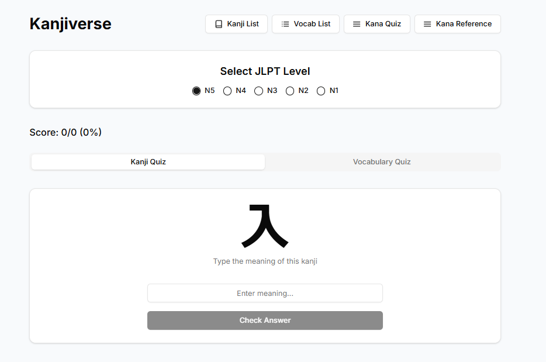
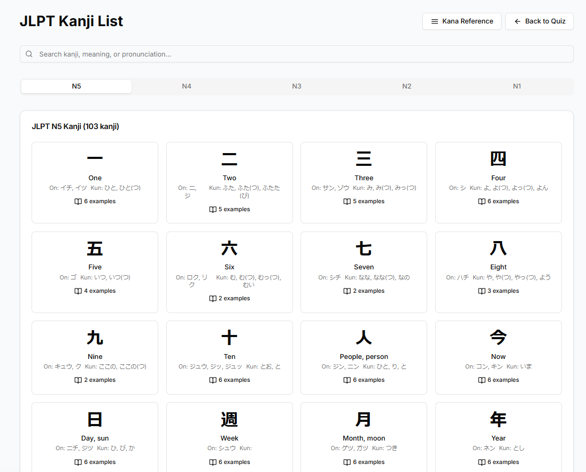
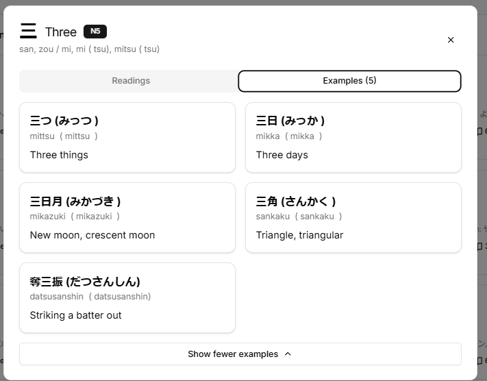

# Kanjiverse (漢字バース) - Japanese Learning App


A modern, interactive web application for learning Japanese kanji, vocabulary, and kana. Built with Next.js and TypeScript, this application provides an engaging way to study Japanese through quizzes, reference materials, and spaced repetition learning.

## ✨ Features

- **Comprehensive Kanji Database**: Complete JLPT N5-N1 kanji with meanings, readings, and example words
- **Interactive Quizzes**: Test your knowledge of kanji, vocabulary, and kana
- **Detailed References**: Look up kanji and vocabulary with detailed information
- **Spaced Repetition**: Learning algorithm that prioritizes items you need to review
- **Mobile-Friendly**: Responsive design that works on all devices
- **Offline Support**: Study even without an internet connection
- **Dark Mode**: Easy on the eyes for late-night study sessions

## 🖼️ Screenshots







## 🚀 Getting Started

### Prerequisites

- Node.js 18.0.0 or later
- npm or yarn

### Installation

1. Clone the repository:
   ```bash
   git clone https://github.com/yourusername/japanese-learning-app.git
   cd japanese-learning-app
